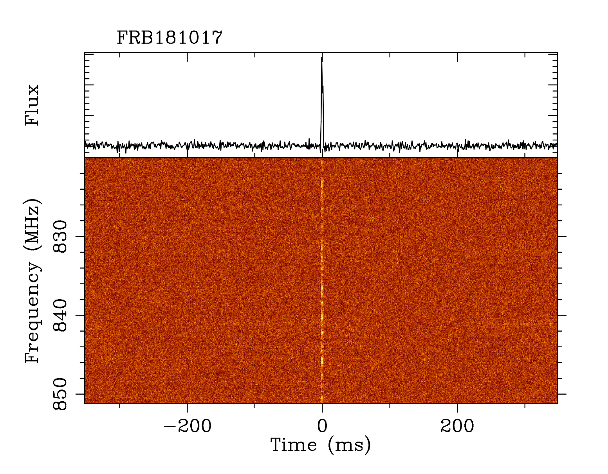
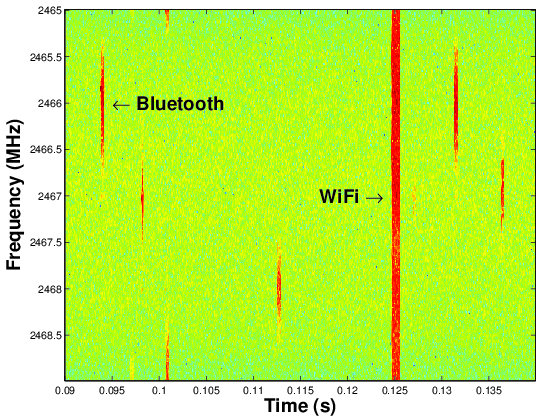
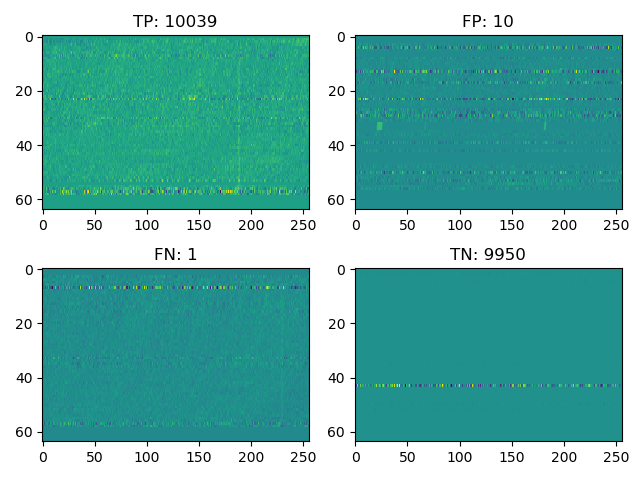
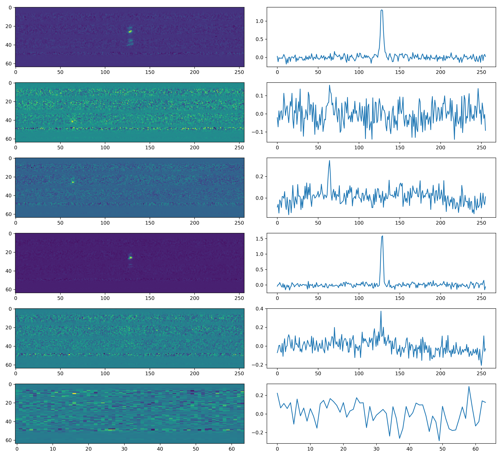
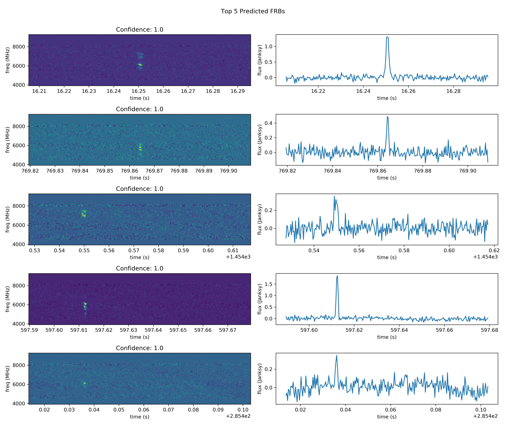

# FRB FBI: Teaching a Neural Network to Distinguish Between Fast Radio Bursts and Radio Frequency Interference

Fast radio bursts (FRBs) are highly energetic radio pulses whose origin is still hotly debated. Neutron stars? Supernovae? Aliens? **Nobody knows!** The image below ([UTMOST collaboration](https://astronomy.swin.edu.au/research/utmost/?p=1508)) is an example spectrogram of a dedispersed FRB. Notice how the signal is broad in frequency but extremely narrow in time.

<p align="center">
  
</p>

At these frequencies, however, a major problem for current detection software is radio frequency interference (RFI). Emissions like WiFi would very likely be mistaken for an FRB, as seen in the image below ([Miller et al. 2007](https://www.researchgate.net/publication/4281289_Service_Discovery_and_Device_Identification_in_Cognitive_Radio_Networks)).


<p align="center">
    
</p>


## Objective
To circumvent this issue, we trained convolutional neural networks (CNNs) to distinguish between FRBs and RFI, given a frequency-time array like the ones above. Due to the unpredictability of FRBs (they come once are are usually never seen again), there are only a few FRB observations, leading to a miniscule training set.

Expanding the training set to an appropriate size requires simulations, and we follow the simulation process outlined in [Connor & van Leeuwen (2018)](https://arxiv.org/pdf/1803.03084.pdf). This appropriately large dataset will then be used to train the model.

The end goal is to be able to whittle down a large data set of proposed FRB candidates so that humans can classify FRBs in a reduced collection of images.

# Usage

## Creating RFI
The first step is creating a suitable set of RFI arrays in which to inject simulated FRBs. Given a directory to a bunch of filterbank (`.fil`) files corresponding to data taken from a specific telescope, the RFI will be randomly selected, dedispersed to a random dispersion measure (DM), and converted into a NumPy array.

Don't worry if you don't know what that means—here's an example.

**Note: All code is written for Python 2.**

```bash
python extract_spectra.py /mnt_blpd9/datax/incoming/vishal/ --total_samples 5000 --save_name training_data/spectra_data.npz
```
In its given form, this command searches for all `.fil` files in `/mnt_blpd9/datax/incoming/vishal/` and extracts 5000 random background observations as Spectra objects and dedisperses them to random DMs, saving the result to `training_data/spectra_data.npz`.

There are several other parameters you can choose, such as minimum/maximum DM, number of samples to take per filterbank file, or number of frequency channels, all found either in `extract_spectra.py` or by running `python extract_spectra.py --help` in the terminal.

Next step: simulation!

## Simulating FRBs and Training the Network
We can now insert our simulated FRBs into these backgrounds and teach the model how to detect them against regular backgrounds.

```bash
python create_model.py 4000 8000 --RFI_samples training_data/spectra_data.npz \
--save_model models/rolled_spectra_model \
--save_spectra simulated_data/spectra_rolled \
--save_confusion_matrix confusion_matrices/rolled_spectra_confusion_matrix.png \
```
This command is quite hefty, but most of these arguments are optional and are supplied as an example.

As specified, this command takes in the background samples you created and saved in `training_data/spectra_data.npz` and trains a classification model to recognize simulated FRBs, saving the best model to `models/rolled_spectra_model`. Simulated data will be saved to `simulated_data/spectra_rolled`. The confusion matrix, a metric to determine the accuracy of classifications and show the lowest confidence predictions, will be saved to `confusion_matrix.png`.

More parameters, like the number of convolutional layers, number of epochs to train with, or how costly to penalize false negatives, can be found in `create_model.py` or by calling `python create_model.py --help`.

If you're curious about the innerworkings behind the simulation, you can take a look in this nicely compiled HTML version of a [Jupyter notebook](simulateFRBclassification/FRBclassifier_notebook.html) detailing the math and code behind generating FRBs, or in [Connor & van Leeuwen (2018)](https://arxiv.org/pdf/1803.03084.pdf), from which this work was inspired.

If this works out, you should start seeing output like this when training begins:
```bash
Epoch 5/32
19904/20000 [============================>.] - ETA: 0s - loss: 0.1444 - acc: 0.9861 — val_recall: 0.9977091633466135 — val_precision: 0.997014034040012 - val_fscore: 0.9976824096810154
fscore improved from -inf to 0.9977, saving model to models/rolled_spectra_model
20000/20000 [==============================] - 23s - loss: 0.1439 - acc: 0.9861 - val_loss: 0.0199 - val_acc: 0.9973
Epoch 6/32
19904/20000 [============================>.] - ETA: 0s - loss: 0.0699 - acc: 0.9916 — val_recall: 0.9968127490039841 — val_precision: 0.9989020860365306 - val_fscore: 0.9968929464904854
fscore (0.9969) did not improve from 0.9977
20000/20000 [==============================] - 23s - loss: 0.0701 - acc: 0.9915 - val_loss: 0.0180 - val_acc: 0.9979
Epoch 7/32
19904/20000 [============================>.] - ETA: 0s - loss: 0.0765 - acc: 0.9903 — val_recall: 0.999402390438247 — val_precision: 0.9839184153755638 - val_fscore: 0.9987978468441566
fscore improved from 0.9977 to 0.9988, saving model to models/rolled_spectra_model
```

At the end of training, your output should end up something like this:
```bash
Training on 20000 samples took 13.0 minutes
Confusion matrix:
   10039      10
       1    9950
accuracy: 0.999450
precision: 0.999005
recall: 0.999900
fscore: 0.999452
```
and a plot should appear like the following:

<p align="center">
    
</p>

## Prediction
Once the model has been trained, predicting whether a filterbank file contains FRBs is as easy as

```bash
python predict.py models/rolled_spectra_model \
/datax/scratch/vgajjar/Test_pipeline/Cand_for_Dominic/FRBcand \
/mnt_blpd9/datax/incoming/spliced_guppi_57991_49905_DIAG_FRB121102_0011.gpuspec.0001.8.4chan.fil \
--save_top_candidates predicted_FRBs/spec_predicted
```

The prediction script takes in a model name, a candidate file, and `.txt` file specifying candidate start times (among other information) and will output the probability that the candidate has an FRB in it.

The given file has 19 candidates in it, and several examples of the candidates are shown below. As you can see, only a few of them are true signals.

<p align="center">
    
</p>

When using the above prediction script with the optional argument `--save_top_candidates`, the candidates that the model has the highest confidence in are saved. For our given example, this looks like

<p align="center">
    
</p>

As you can see, the CNN predicts each of these arrays to contain FRBs with absolute certainty, and from visual inspection, they do! The model does misclassify several instances of RFI as FRBs, however, so it isn't completely perfect.

With more training data and fine-tuning of the weights on false positives, the model should improve and can be deployed on different telescope data.

This code is currently being integrated into the FRB search pipeline by Vishal Gajjar of Breakthrough Listen team at Berkeley and will hopefully be able to pick out many more fast radio bursts.

## Acknowledgments
* Vishal Gajjar, for mentorship
* Liam Connor and Joeri van Leeuwen, for guidance on simulating FRBs
* Breakthrough Listen, for sponsorship
* Francois Chollet, for saving me with the ease of Keras