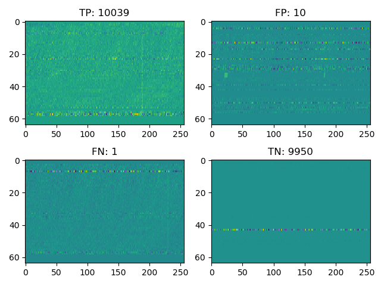
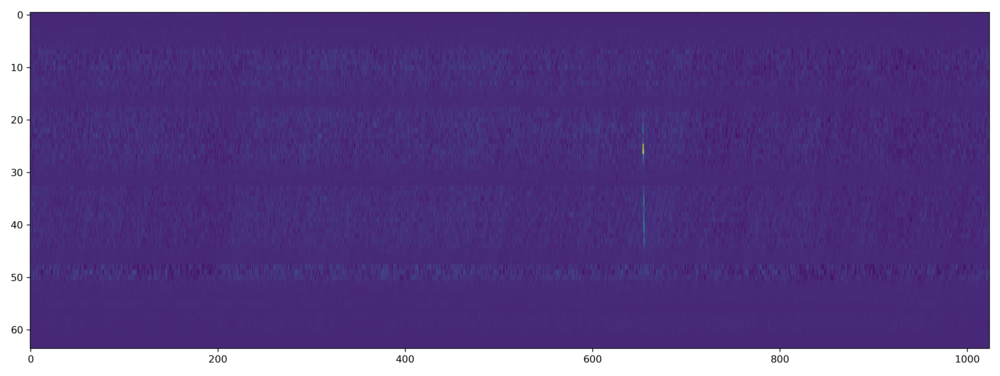
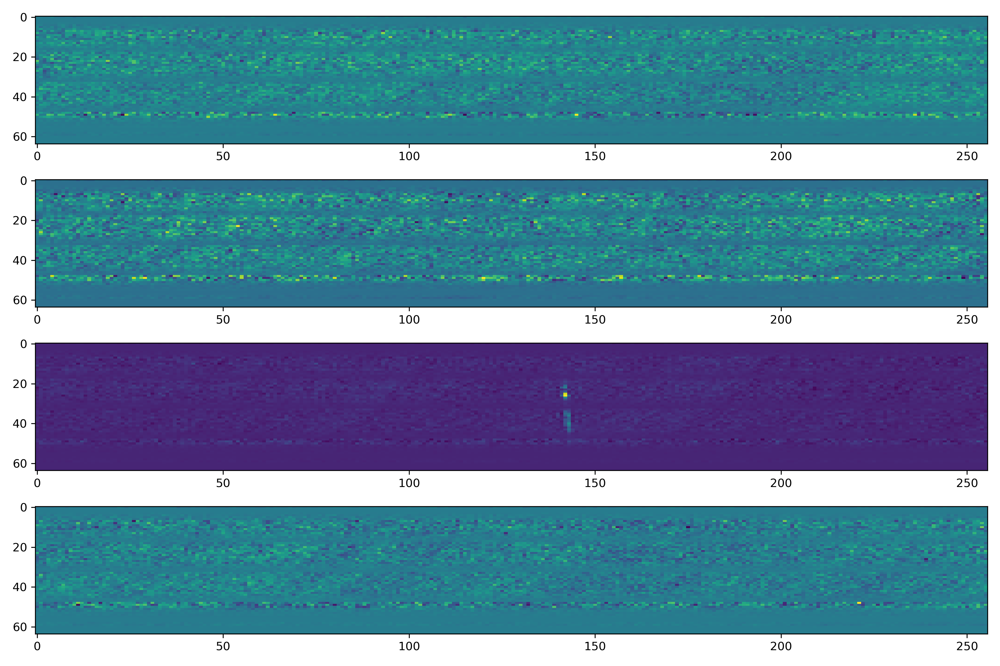

# FRB FBI: Teaching a Neural Network to Distinguish Between Fast Radio Bursts and Radio Frequency Interference

Fast radio bursts (FRBs) are highly energetic radio pulses whose origin is still hotly debated. Neutron stars? Supernovae? Aliens? **Nobody knows!** The image below ([UTMOST collaboration](https://astronomy.swin.edu.au/research/utmost/?p=1508)) is an example spectrogram of a dedispersed FRB. Notice how the signal is broad in frequency but extremely narrow in time.

<p align="center">
  
</p>

At these frequencies, however, a major problem for current detection software is radio frequency interference (RFI). Emissions like WiFi would very likely be mistaken for an FRB, as seen in the image below ([Miller et al. 2007](https://www.researchgate.net/publication/4281289_Service_Discovery_and_Device_Identification_in_Cognitive_Radio_Networks)).


<p align="center">
    
</p>


## Objective
To circumvent this issue, we trained convolutional neural networks (CNNs) to distinguish between FRBs and RFI, given a frequency-time array like the ones above. Due to the unpredictability of FRBs (they come once are are usually never seen again), there are only a few FRB observations, leading to a miniscule training set.

Expanding the training set to an appropriate size requires simulations, and we follow the simulation process outlined in [Connor & van Leeuwen (2018)](https://arxiv.org/pdf/1803.03084.pdf). This appropriately large dataset will then be used to train the model.

The end goal is to be able to whittle down a large data set of proposed FRB candidates so that humans can classify FRBs in a reduced collection of images.

# Usage

## Creating RFI
The first step is creating a suitable set of RFI arrays in which to inject simulated FRBs. Given a directory to a bunch of `.ar` files corresponding to data taken from a specific telescope, the RFI will be randomly selected, dedispersed to a random dispersion measure (DM), and converted into a NumPy array.

Don't worry if you don't know what that means—here's an empirical example.

**Note: This must be run in Python 2, because `psrchive` (which converts from `.ar` to `.npy`) is written for Python 2.**

```bash 
python2 psr2np.py /datax/scratch/vgajjar/Archive_files_to_train/ --num_samples 5000 --save_name rfi.npz
```
What this does is find all the `.ar` files in `/datax/scratch/vgajjar/Archive_files_to_train/` and creates 5000 background samples that are characteristic of what the telescope would observe after dedispersion.

There are several other parameters you can choose, such as minimum/maximum DM or number of frequency channels in each array, found either in `psr2np.py` or by running `python psr2np.py --help` in the terminal.

Next step: simulation!

## Simulation and Training the Network
With these backgrounds, we can now insert our simulated FRBs and teach the model how to detect them.

**Note: This code was written in Python 3, so it is recommended to have a separate conda environment with all necessary packages on Python 3 installed.**
```bash
python3 simulated_NN.py 4000 8000 --RFI_array experimental_data/rfi.npz --save_model models/first_model --save_confusion_matrix confusion_matrix.png
```
This command will take in the RFI you created and saved in `experimental_data/rfi.npz` and train a classification model, saving the best one to `models/first_model`. The confusion matrix, a metric to determine the accuracy of classifications and show the lowest confidence predictions, will be saved to `confusion_matrix.png`.

More parameters, like the number of convolutional layers, number of epochs to train with, or how costly to penalize false negatives, can be found in `simulated_NN.py` or by calling `python3 simulated_NN.py --help`.

If you're curious about the innerworkings behind the simulation, you can take a look in this nicely compiled HTML version of a [Jupyter notebook](simulateFRBclassification/FRBclassifier_notebook.html) detailing the math and code behind generating FRBs, or in [Connor & van Leeuwen (2018)](https://arxiv.org/pdf/1803.03084.pdf), from which this work was inspired.

If this works out, you should start seeing output like this when training begins:
```bash
Epoch 5/32
19904/20000 [============================>.] - ETA: 0s - loss: 0.1444 - acc: 0.9861 — val_recall: 0.9977091633466135 — val_precision: 0.997014034040012 - val_fscore: 0.9976824096810154
fscore improved from -inf to 0.9977, saving model to models/first_model
20000/20000 [==============================] - 23s - loss: 0.1439 - acc: 0.9861 - val_loss: 0.0199 - val_acc: 0.9973
Epoch 6/32
19904/20000 [============================>.] - ETA: 0s - loss: 0.0699 - acc: 0.9916 — val_recall: 0.9968127490039841 — val_precision: 0.9989020860365306 - val_fscore: 0.9968929464904854
fscore (0.9969) did not improve from 0.9977
20000/20000 [==============================] - 23s - loss: 0.0701 - acc: 0.9915 - val_loss: 0.0180 - val_acc: 0.9979
Epoch 7/32
19904/20000 [============================>.] - ETA: 0s - loss: 0.0765 - acc: 0.9903 — val_recall: 0.999402390438247 — val_precision: 0.9839184153755638 - val_fscore: 0.9987978468441566
fscore improved from 0.9977 to 0.9988, saving model to models/first_model
```

At the end of training, your output should end up something like this:
```bash
Training on 20000 samples took 13.0 minutes
Confusion matrix:
   10039      10
       1    9950
accuracy: 0.999450
precision: 0.999005
recall: 0.999900
fscore: 0.999452
```
and a plot should appear like the following:

<center>

<figcaption> Confusion matrix. From left to right, top to bottom: number of true positives, false positives, false negatives, true negatives. </figcaption>
</center>

## Prediction
Once the model has been trained, predicting whether an `.ar` file contains an FRB is as easy as

```bash
python predict.py models/first_model /datax/scratch/vgajjar/Archive_files_to_test/real_frb.ar
```
**Again, this is in Python 2, because `psrchive` needs to convert the `.ar` file into `.npy` format.** Sorry, folks!

The prediction script takes in a model name and a candidate file and will output the probability that the candidate has an FRB in it.

In this example, the model will be tested on the following candidate:

<center>

<figcaption> Unaltered candidate file with FRB.
</center>


*cappyton*

There is a strong pulse at around t~650 on the x-axis. Because the network was trained on arrays with only 256 columns, this candidate will be split up into four different arrays from its original size of 1024 columns.

<center>

<figcaption> Candidate after splitting into 256 time bins.
</center>

As you can see, the FRB is contained in the third array. The output of the prediction script should look something like this:

```bash
Splitting each array into 4 blocks
(4, 64, 256)
4/4 [==============================] - 2s
[0.1718652  0.15840465 1.         0.18031006]
```

The CNN predicts each of the arrays to have an FRB (> 50%) in the third array with absolute certainty, while also correctly guessing that there is no FRB in the other arrays.

## Acknowledgments
* Vishal Gajjar, for mentorship
* Liam Connor and Joeri van Leeuwen, for guidance on simulating FRBs
* Breakthrough Listen, for sponsorship
* Francois Chollet, for saving me with the ease of Keras